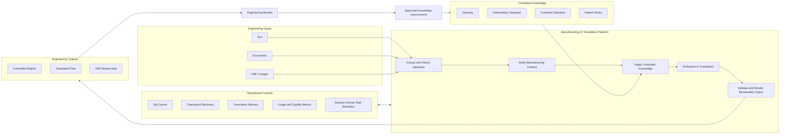

# Manufacturing AI Translation Platform Architecture

## Architecture Intent

The platform is a governed manufacturing-translation mechanism, not a standalone prompt or a collection of word pairs. It combines deterministic knowledge controls, contextual AI reasoning, resilient document processing, engineering review, and continuous improvement.



## Design Decisions

### 1. Separate detection quality from translation quality

For HMI and image inputs, incorrect cell segmentation or OCR cannot be repaired reliably by a glossary. The architecture therefore treats region detection, text recognition, terminology control, translation, and rendering as separate quality stages.

### 2. Use deterministic controls where consistency matters

Approved terminology, protected codes, file structure, checkpoints, and output reconstruction should be deterministic. Generative reasoning is used for context-sensitive language decisions rather than for every system responsibility.

### 3. Preserve engineering reviewability

Outputs retain source-to-translation traceability. HMI results use numbered regions; document results retain structural locations; glossary matches and job status can be reviewed independently.

### 4. Design for interruption and repeat work

Large files require checkpoints, retry handling, translation memory, and job state. These controls reduce rework and make the workflow operable on imperfect networks and shared infrastructure.

### 5. Build knowledge governance into the system

Engineering corrections should not remain isolated edits. Approved corrections return to controlled knowledge through an ownership and review process, improving future translations and supporting Yokoten.

### 6. Make task ownership explicit on a shared pilot

Framework-level session state is not sufficient when background jobs are stored in a shared database. Each document job, lookup, stop action, preview, result, and checkpoint must carry the same opaque session owner. This prevents one anonymous browser session from operating on another session's work through the application UI.

The pilot uses an opaque client-session identifier to maintain continuity across refreshes. It is deliberately described as session isolation rather than authentication: a production service still requires enterprise identity, authorization, retention controls, and auditability.

## Deployment Evolution

```text
Engineer prototype
    → shared-server pilot
    → capacity and security validation
    → IT-managed production service
    → multi-instance scaling and plant rollout
```

The public repository documents this architecture without exposing private infrastructure, controlled company terminology, or production data.
