# High-Level Architecture

## Design objective

The engine separates deterministic engineering controls from probabilistic language generation. A model may propose English, but software controls decide what may be translated, what must be preserved, how the output is reconstructed, and whether it is ready for review.

```mermaid
flowchart LR
    A["Technical file or text"] --> B["Encoding and structure parser"]
    B --> C["Japanese fragment detector"]
    C --> D["Controlled terminology"]
    D --> E["Identifier protection"]
    E --> F["Translation adapter"]
    F --> G["Format-specific reconstruction"]
    G --> H["Deterministic quality validation"]
    H --> I["Engineering output and review evidence"]
```

## Requirement profiles

| Profile | Translation scope | Protected behavior | Validation emphasis |
|---|---|---|---|
| PLC | Comment text and Japanese fragments | Addresses, device IDs, signal IDs | Concise wording and identifier equality |
| Robot | Comments or labels only | Instructions, positions, variables, encoding | Structure and encoding preservation |
| HMI | Visible label text | Codes and fixed screen identifiers | Character-length limit and reviewability |
| Structured file | Selected text-bearing fields | Rows, columns, formulas, keys | Shape and field integrity |

## Component responsibilities

1. **Parser** identifies the file encoding and the regions that are eligible for translation.
2. **Fragment detector** isolates Japanese within mixed-language content instead of rewriting the full field.
3. **Terminology controller** injects only approved mappings and records the applied terms.
4. **Identifier protector** replaces technical IDs with temporary tokens before model processing.
5. **Translation adapter** supplies contextual translation and can point to a local stub, enterprise model, or approved service.
6. **Reconstructor** restores protected content and original file structure.
7. **Validator** produces explicit checks and review warnings; it does not silently declare unknown content correct.

## Trust boundary

The public implementation stops at an adapter interface. No API provider, credential, internal endpoint, proprietary prompt, or production deployment configuration is included.
