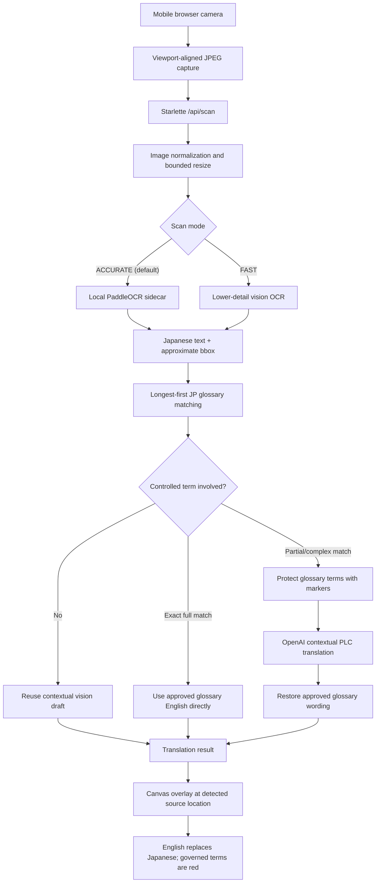

# Architecture

## Design goals

The lens prioritizes translation accuracy, then latency, then ease of use and
operational reliability. Camera frames stay in memory and the public example
uses synthetic terminology only.

## Runtime flow

## Components

| Component | Responsibility |
| --- | --- |
| Browser camera UI | Full-screen capture, mode selection, progress, frozen-frame overlay |
| Starlette API | Request validation, bounded concurrency, timeout, result cache |
| Local OCR sidecar | Japanese detection and pixel-derived bounding boxes on `127.0.0.1:8506` |
| Vision OCR | Fast-mode Japanese detection, draft translation, and approximate boxes |
| Glossary loader | Cached CSV/XLSX loading with `JP` and `EN` column validation |
| Terminology matcher | Longest-first source matching to protect specific phrases before short terms |
| Context translator | OpenAI translation for sentences containing controlled terminology |
| Canvas renderer | Covers the Japanese row and draws English at the same vertical location |

## Terminology-control path

1. The glossary is loaded once and cached by file path and modification time.
2. Detected Japanese is matched against approved `JP → EN` pairs, longest term first.
3. A complete source-term match uses the approved English directly.
4. Sentences with partial glossary matches replace Japanese terms with protected
   markers such as `[[GLOSSARY_1]]`.
5. OpenAI translates the surrounding manufacturing context while preserving the
   markers.
6. The application restores the approved English terms and highlights them in red.
7. Rows without controlled terms reuse the vision draft to avoid an unnecessary
   second API request.

## Accuracy and performance modes

- **ACCURATE** is the default. It uses PaddleOCR in an isolated local process to
  return recognition boxes derived from image pixels. The frame is not sent to
  OpenAI; extracted text is sent for glossary-controlled translation.
- **FAST** uses a 1024-pixel bounded frame and lower-detail vision processing for
  large, clear text. Its boxes remain approximate.
- The selected mode is saved in browser local storage.
- Results are cached in memory by image content and scan mode.
- The API bounds concurrent scans and returns a controlled timeout instead of
  leaving the browser waiting indefinitely.

## Data and security boundaries

- Camera frames are processed in memory and are not intentionally persisted.
- The OCR sidecar binds only to `127.0.0.1`; it is not exposed by the mobile ingress.
- Accurate mode sends extracted text, not the camera frame, to OpenAI.
- Fast mode sends the frame to the configured vision service.
- API keys belong in `.env`, which is excluded from source control.
- The repository includes only a synthetic glossary sample.
- Mobile camera access requires a trusted HTTPS origin.
- Production deployment should use an approved private HTTPS ingress and service
  identity; a development tunnel is not a production boundary.
- Translation is assistive output and must not control machinery or make safety
  decisions.

## Known limitations

- Local OCR boxes improve geometric reproducibility but do not guarantee correct
  recognition, translation, or complete coverage of small/glared text.
- Fast-mode general-purpose vision boxes are approximate and must not be treated
  as deterministic pixel coordinates.
- Glare, moiré, camera angle, small fonts, and dense ladder logic can reduce OCR
  accuracy.
- Accurate mode can take longer because it uses high-detail image processing and
  may perform a second contextual translation call for controlled terminology.

