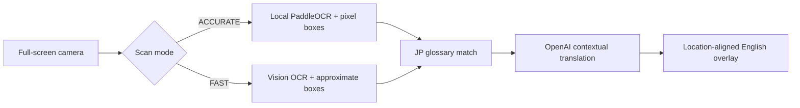

# Real-Time PLC Translation Lens

A public-safe mobile camera prototype that turns one Japanese PLC/HMI screen into a reviewable English overlay. It combines vision-based region detection, controlled manufacturing terminology, and contextual translation without saving camera frames intentionally.

> Portfolio boundary: this project contains synthetic glossary examples only. It does not include production screens, internal terminology, credentials, company endpoints, or deployment configuration.

## User Flow

1. Open the application in a camera-capable mobile browser.
2. Use the default **ACCURATE** mode, or select **FAST** for large, clear text.
3. Align one PLC or HMI screen and select **SCAN**.
4. In **ACCURATE**, local PaddleOCR returns Japanese text and pixel-derived boxes.
   In **FAST**, the vision model provides approximate text and boxes.
5. Controlled glossary terms are matched and OpenAI translates the extracted
   text while protected markers preserve approved wording.
6. English replaces Japanese at the detected screen position; governed terms are red.
7. Select **NEXT SCREEN**, move the camera, and repeat.

## Architecture



The prototype separates visual detection, terminology governance, contextual
translation, and rendering so each quality layer can be evaluated independently.
See [ARCHITECTURE.md](ARCHITECTURE.md) for the complete runtime paths, component
boundaries, accuracy modes, and security assumptions. The field-driven localization
decision is recorded in [ADR-001](docs/ADR-001-local-pixel-ocr-localization.md).

## Run Locally

Requirements: 64-bit Python 3.11+ and an OpenAI API key. Accurate mode uses a
second, isolated Python environment so PaddleOCR cannot change the web app's dependencies.

```powershell
cd projects/real-time-plc-translation-lens
python -m venv .venv
.\.venv\Scripts\python.exe -m pip install -r requirements.txt
python -m venv .ocr-venv
.\.ocr-venv\Scripts\python.exe -m pip install -r requirements-ocr.txt
Copy-Item .env.example .env
# Edit .env and replace the placeholder API key.
# Terminal 1: first start downloads the official OCR models.
.\start-ocr.ps1
# Terminal 2:
.\start-lens.ps1
```

Open `http://localhost:8505` for a desktop-camera test. Mobile browsers generally require a trusted HTTPS origin for camera access; use an approved HTTPS deployment rather than exposing the development port directly.

## Configuration

- `OPENAI_API_KEY`: required; never commit it.
- `OPENAI_MODEL`: defaults to `gpt-4.1-mini`.
- `PLC_LENS_GLOSSARY_PATH`: optional path to a CSV or XLSX glossary containing `JP` and `EN` columns.
- `PLC_LENS_LOCAL_OCR_URL`: defaults to the local-only `http://127.0.0.1:8506/ocr`.

The included `glossary.csv` contains synthetic examples and can be replaced with an approved glossary outside source control.

## Scan Modes

- **ACCURATE** (default): local PaddleOCR supplies pixel-derived Japanese text
  coordinates; OpenAI receives extracted text for glossary-controlled translation.
- **FAST**: lower-detail vision processing provides approximate coordinates for
  large, clear text when the local OCR sidecar is not desired.

The browser remembers the selected mode. Accurate mode remains the default because
the project prioritizes translation quality over latency.

## Safety and Limitations

- Translation is assistive output and requires engineering review.
- Do not use the overlay as a machine-control command or safety decision.
- In Accurate mode, the camera frame stays in the local Lens/OCR processes;
  extracted text is still sent to OpenAI for translation and therefore requires
  an approved data-handling boundary.
- Fast mode sends the camera frame to the configured vision service.
- OCR accuracy depends on focus, glare, font size, camera angle, and screen density.
- The in-memory frame cache is process-local and is not intended as persistent storage.
