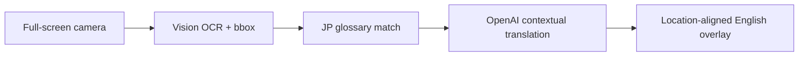

# Real-Time PLC Translation Lens

A public-safe mobile camera prototype that turns one Japanese PLC/HMI screen into a reviewable English overlay. It combines vision-based region detection, controlled manufacturing terminology, and contextual translation without saving camera frames intentionally.

> Portfolio boundary: this project contains synthetic glossary examples only. It does not include production screens, internal terminology, credentials, company endpoints, or deployment configuration.

## User Flow

1. Open the application in a camera-capable mobile browser.
2. Use the default **ACCURATE** mode, or select **FAST** for large, clear text.
3. Align one PLC or HMI screen and select **SCAN**.
4. The vision model locates Japanese labels and returns contextual draft English.
5. Controlled glossary terms are matched; complex controlled sentences use a
   protected-marker OpenAI translation path.
6. English replaces Japanese at the detected screen position; governed terms are red.
7. Select **NEXT SCREEN**, move the camera, and repeat.

## Architecture



The prototype separates visual detection, terminology governance, contextual
translation, and rendering so each quality layer can be evaluated independently.
See [ARCHITECTURE.md](ARCHITECTURE.md) for the complete runtime paths, component
boundaries, accuracy modes, and security assumptions.

## Run Locally

Requirements: Python 3.11+ and an OpenAI API key with access to a vision-capable model.

```powershell
cd projects/real-time-plc-translation-lens
python -m venv .venv
.\.venv\Scripts\python.exe -m pip install -r requirements.txt
Copy-Item .env.example .env
# Edit .env and replace the placeholder API key.
.\start-lens.ps1
```

Open `http://localhost:8505` for a desktop-camera test. Mobile browsers generally require a trusted HTTPS origin for camera access; use an approved HTTPS deployment rather than exposing the development port directly.

## Configuration

- `OPENAI_API_KEY`: required; never commit it.
- `OPENAI_MODEL`: defaults to `gpt-4.1-mini`.
- `PLC_LENS_GLOSSARY_PATH`: optional path to a CSV or XLSX glossary containing `JP` and `EN` columns.

The included `glossary.csv` contains synthetic examples and can be replaced with an approved glossary outside source control.

## Scan Modes

- **ACCURATE** (default): high-detail vision for small PLC text and reliable placement.
- **FAST**: lower-detail processing for large, clear text.

The browser remembers the selected mode. Accurate mode remains the default because
the project prioritizes translation quality over latency.

## Safety and Limitations

- Translation is assistive output and requires engineering review.
- Do not use the overlay as a machine-control command or safety decision.
- Do not scan confidential production screens into an unapproved external service.
- OCR accuracy depends on focus, glare, font size, camera angle, and screen density.
- The in-memory frame cache is process-local and is not intended as persistent storage.
